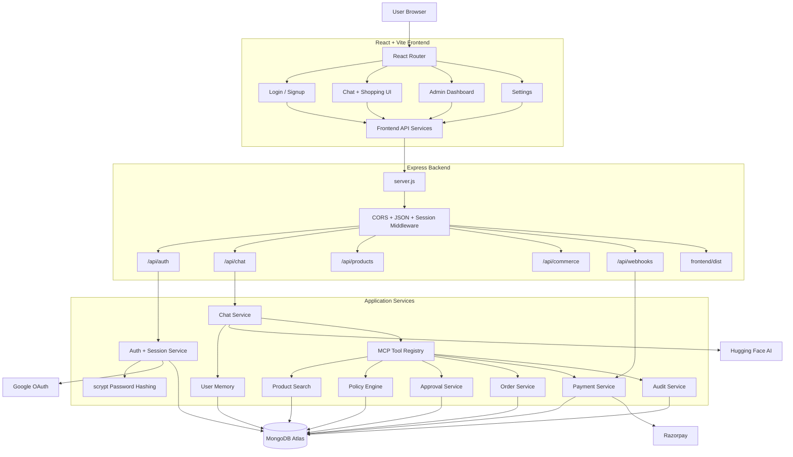

# AgentPay

AgentPay is a conversational commerce platform that combines AI chat, product discovery, policy-aware purchasing, approvals, orders, and Razorpay payments in one application.

The system uses a React/Vite frontend, an Express backend, MongoDB persistence, an in-process MCP capability layer, Google OAuth, local email/password authentication, and optional external product sources.

## Features

- Email/password signup and login
- Google OAuth login
- Secure HTTP-only session cookies
- Role-aware admin dashboard
- Conversational AI assistant
- Cross-chat user memory for explicit facts
- Product search with structured filters
- MCP tools for search, policy, approvals, orders, and payments
- Policy enforcement before commerce actions
- Approval workflow for higher-value purchases
- Razorpay payment creation, verification, reconciliation, and webhooks
- Audit events for security-sensitive operations
- MongoDB-backed persistence
- Production deployment as a single Render Web Service

## System Architecture



## Repository Structure

```text
AgentPay/
├── backend/
│   ├── app.js                 Express app, middleware, routes, static serving
│   ├── server.js              Database startup and Render listener
│   ├── config/                Environment and MongoDB configuration
│   ├── controllers/           HTTP request handlers
│   ├── errors/                Application error types
│   ├── middleware/            Authentication, logging, and error middleware
│   ├── models/                Mongoose models
│   ├── repositories/          Database access layer
│   ├── routes/                Express route modules
│   ├── services/              Auth, chat, search, commerce, payment, and audit logic
│   ├── mcp/                   MCP server, client, tools, and schemas
│   ├── seed/                  Catalog and product seed modules
│   ├── seed.js                Demo and admin provisioning entry point
│   └── tests/                 Node test suite
├── frontend/
│   ├── src/
│   │   ├── components/        Reusable UI components
│   │   ├── pages/             Login, signup, home, settings, admin pages
│   │   ├── services/           Frontend API and storage services
│   │   └── App.jsx            Application routes and auth state
│   ├── index.html
│   └── package.json
└── README.md
```

## Requirements

- Node.js 20 or newer recommended
- npm
- MongoDB Atlas or a local MongoDB instance
- Google OAuth client ID
- Razorpay credentials for payment flows

## Local Setup

### 1. Install backend dependencies

```powershell
cd AgentPay/backend
npm install
```

### 2. Install frontend dependencies

```powershell
cd ../frontend
npm install
```

### 3. Configure environment variables

Copy the example file:

```powershell
cd ../backend
Copy-Item .env.example .env
```

Set the required values in `backend/.env`:

```env
GOOGLE_CLIENT_ID=your-google-client-id
MONGODB_URI=your-mongodb-connection-string
FRONTEND_ORIGIN=http://localhost:5173
```

Never commit `.env`, API keys, database credentials, OAuth secrets, or payment secrets.

## Development

Start the backend:

```powershell
cd AgentPay/backend
npm run dev
```

Start the frontend in a second terminal:

```powershell
cd AgentPay/frontend
npm run dev
```

Local URLs:

- Frontend: `http://localhost:5173`
- Backend: `http://localhost:5000`
- Health check: `http://localhost:5000/health`

## Production Build

The backend build script installs frontend dependencies and creates the Vite production build:

```powershell
cd AgentPay/backend
npm run build
```

This generates:

```text
frontend/dist/
```

Express serves that build and falls back to `index.html` for frontend routes such as `/login`, `/home`, `/admin`, and `/settings`. Existing `/api/*` routes are handled before static frontend serving.

## Render Deployment

Create one Render **Web Service** with:

```text
Root Directory: AgentPay/backend
Build Command: npm run build
Start Command: npm start
```

The server listens on:

```text
process.env.PORT
0.0.0.0
```

Configure production environment variables in the Render dashboard. Do not place secrets in this repository.

Recommended production values include:

```env
NODE_ENV=production
GOOGLE_CLIENT_ID=...
MONGODB_URI=...
FRONTEND_ORIGIN=https://your-render-domain.onrender.com
SESSION_COOKIE_SECURE=true
SESSION_COOKIE_SAME_SITE=lax
RAZORPAY_KEY_ID=...
RAZORPAY_KEY_SECRET=...
RAZORPAY_WEBHOOK_SECRET=...
```

## Authentication

### Local authentication

1. The frontend submits credentials to `/api/auth/signup` or `/api/auth/login`.
2. The backend normalizes the email address.
3. Passwords are hashed and verified using Node.js `crypto.scrypt`.
4. A session is created through the shared `SessionService`.
5. The raw session token is sent only as the HTTP-only `agentpay_session` cookie.
6. `/api/auth/me` validates the session and returns a safe user object.

Passwords and password hashes are never returned to the frontend.

### Google authentication

Google credentials are verified by the backend. Google users use the same session mechanism as local users. The Google flow does not enter the MCP layer or expose provider credentials to frontend services.

### Admin provisioning

Admin accounts are provisioned by the backend seed flow. Provide the password only through the terminal environment when provisioning:

```powershell
cd AgentPay/backend
$env:ADMIN_PASSWORD = Read-Host "Enter admin password"
node .\seed.js
Remove-Item Env:ADMIN_PASSWORD
```

The password is hashed with `scrypt` before storage. It is never stored in plaintext or frontend code.

## API Overview

| Route | Purpose |
| --- | --- |
| `POST /api/auth/signup` | Create a local account and session |
| `POST /api/auth/login` | Authenticate with email and password |
| `POST /api/auth/google` | Authenticate with Google OAuth |
| `GET /api/auth/me` | Return the authenticated user |
| `POST /api/auth/logout` | Delete the current session |
| `GET /api/auth/admin/users` | Admin-only safe user list |
| `POST /api/chat` | Process normal chat and shopping requests |
| `POST /api/products/search` | Search products directly |
| `/api/commerce/*` | Offers, policies, approvals, orders, and payments |
| `/api/webhooks/*` | Razorpay webhook processing |
| `GET /health` | Report service and database status |

All authenticated routes use the shared session cookie and backend authentication middleware.

## MCP Layer

The in-process MCP layer exposes these tools:

- `search_products`
- `select_offer`
- `check_policy`
- `request_approval`
- `create_order`
- `create_payment`
- `verify_payment`
- `reconcile_payment`

Tool inputs are schema-validated with Zod. State-changing tools require an authenticated user context. Tool calls are delegated to existing backend services and recorded by the audit service.

See [backend/mcp/README.md](backend/mcp/README.md) for MCP-specific details.

## Testing and Quality Checks

Run backend tests:

```powershell
cd AgentPay/backend
node --test .\tests\*.test.js
```

Run frontend checks:

```powershell
cd AgentPay/frontend
npm run build
npm run lint
```

Important regression areas include authentication/session behavior, Google login, chat memory, shopping flows, MCP tools, product search, policy enforcement, orders, payments, and webhooks.

## Security Notes

- Keep all secrets in environment variables.
- Use HTTPS and secure cookies in production.
- Do not log passwords, session tokens, OAuth credentials, or payment signatures.
- Passwords are stored only as scrypt hashes.
- Session tokens are stored server-side only as hashes.
- User-facing responses use safe representations that exclude password data.
- Payment verification and webhook handling remain backend-authoritative.
